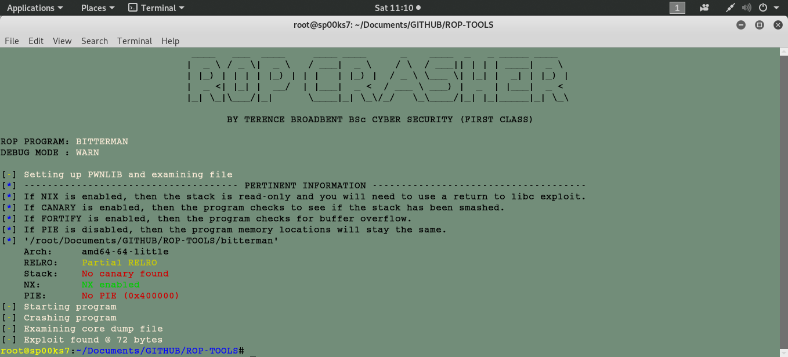

# ROP TOOLS
## PYTHON SCRIPT FILES TO PERFORM RETURN-ORIENTED PROGRAMMING (ROP) EXPLOITS ON VULNERABLE ELF FILES.

## ROP TOOLS
Usage: python RopCrasher.py bitterman mode

| LANGUAGE | FILENAME      | MD5 HASH                         | DESCRIPTION                                                    |
|--------  |---------      |---------                         | -----                                                          |
| python   | RopCrasher.py | 3b77ea45fc4751e4d06063e9a8520198 | Crash's running ELF program to produce initial segfault offset |

- [x] Recognised modes include: critical, debug, error, info, notset, warn and warning...
- [x] For further information see - http://docs.pwntools.com/en/stable

Return-Oriented Programming (ROP) - is an exploitation technique that bypasses DEP. It does that by chaining together legitimate code that's already in executable memory. This requires the attacker to either (a) have complete control of the stack, or (b) have control of rip/eip (the instruction pointer register) and the ability to change esp/rsp (the stack pointer) to point to another buffer.

### CONSOLE DISPLAY

## BITTERMAN EXPLOIT

Usage: python bitterman1.py or bitterman2.py

| LANGUAGE | FILENAME      | MD5 HASH                         | EXPLOIT METHOD |
|--------  |---------      |---------                         | -----          |
| python   | bitterman1.py | 696abe10a83b8750df38297729387277 | Manual         |
| python   | bitterman2.py | ca992d4a6a6daf57cc6509c4b957228b | PWN Tools      |

| LANGUAGE | BINARIES      | MD5 HASH                         |
|--------  |---------      |---------                         |
| elf      | bitterman     | 7bacffdf0ba71b1247f0b7359f253ecc |
| elf      | rlic.so.6     | e63efc14f34504f4ac4cf7d63ed229ca |

